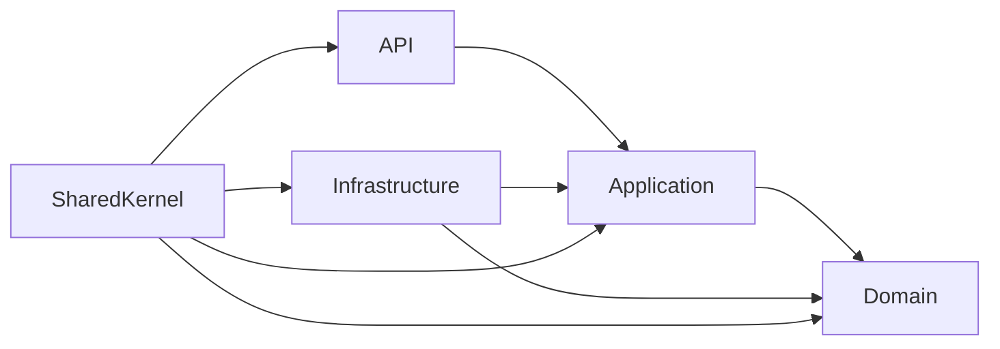

# Arquitectura de MySaaSAgent

Este proyecto sigue una **arquitectura hexagonal (Clean Architecture)** que separa claramente las responsabilidades en capas independientes:

- **API** – Punto de entrada HTTP (ASP.NET Core). Solo depende de la capa de Aplicación.
- **Application** – Capa de casos de uso / orquestación. Define interfaces y DTOs. No contiene lógica de dominio.
- **Domain** – Modelo de dominio puro (entidades, value objects, eventos, repositorios). No tiene dependencias externas.
- **Infrastructure** – Implementaciones concretas de los contratos (repositorios, servicios externos, IoC). Depende del dominio.
- **SharedKernel** – Código reutilizable y utilidades comunes.

Cada capa se comunica únicamente hacia el interior (API → Application → Domain) y la infraestructura inyecta sus implementaciones a través del contenedor IoC.

## Diagrama de flujo de dependencias



## Ventajas

- **Testabilidad**: Los casos de uso pueden probarse aislados usando mocks de las interfaces.
- **Mantenibilidad**: Cambiar una capa (por ejemplo, la base de datos) no afecta a las demás.
- **Escalabilidad**: Fácil de añadir nuevas funcionalidades (bots, integraciones) sin romper la arquitectura existente.

---

### Cómo iniciar el proyecto

```bash
# Clonar y restaurar dependencias
git clone <repo-url>
cd mySaaSAgent
dotnet restore

# Ejecutar la API
cd MySaaSAgent.API
dotnet run
```

Visita `https://localhost:5001/swagger` para explorar los endpoints.
