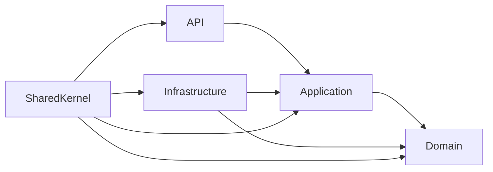

# MeetLines Architecture

This project follows a **hexagonal architecture (Clean Architecture)** that clearly separates responsibilities into independent layers:

- **API** – HTTP entrypoint (ASP.NET Core). Only depends on the Application layer.
- **Application** – Use case/orchestration layer. Defines interfaces and DTOs. It contains no domain logic.
- **Domain** – Pure domain model (entities, value objects, events, repositories). It has no external dependencies.
- **Infrastructure** – Concrete implementations of contracts (repositories, external services, IoC). Depends on Domain.
- **SharedKernel** – Reusable code and common utilities.

Each layer communicates only inward (API → Application → Domain), and infrastructure injects implementations through an IoC container.

## Dependency flow diagram



## Benefits

- **Testability**: Use cases can be tested in isolation with mocked interfaces.
- **Maintainability**: Changing one layer (e.g., the database) does not impact the others.
- **Scalability**: Easy to add new capabilities (bots, integrations) without breaking existing architecture.

---

### How to start the project

```bash
# Clone and restore dependencies
git clone <repo-url>
cd MeetLines
dotnet restore

# Run the API
cd MeetLines.API
dotnet run
```

Visit `https://localhost:5001/swagger` to explore the endpoints.
